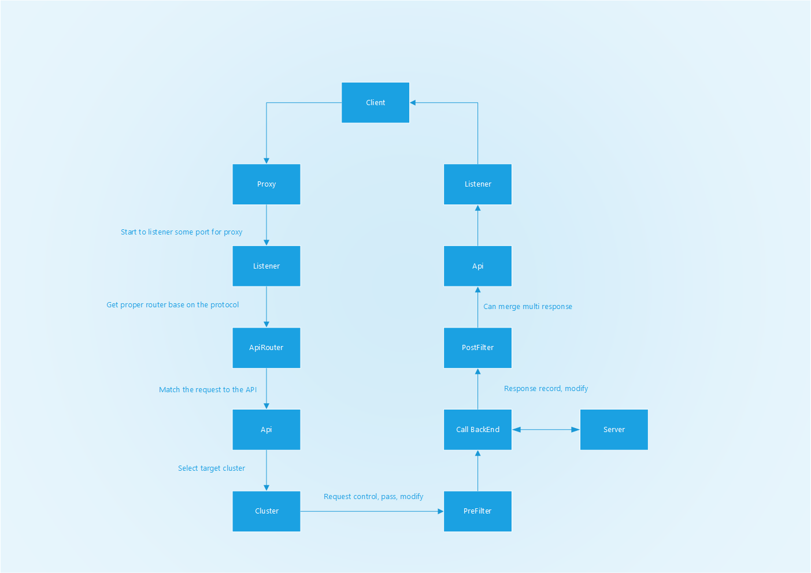
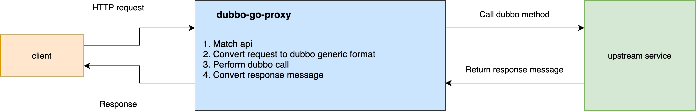

[](https://travis-ci.org/dubbogo/dubbo-go-pixiu)

[中文](./README_CN.md) 

### Mascot

<div>
<table>
  <tbody>
  <tr></tr>
    <tr>
      <td align="center"  valign="middle">
        <a href="http://alexstocks.github.io/html/dubbogo.html" target="_blank">
          
        </a>
      </td>
    </tr>
    <tr></tr>
  </tbody>
</table>
</div>
    
### Introduction

dubbo-go-pixiu is a gateway that mainly focuses on providing gateway solution to your Dubbo and RESTful services.

It supports HTTP-to-Dubbo and HTTP-to-HTTP proxy and more protocols will be supported in the near future.

## Quick Start

#### 1 cd samples dir

```
cd samples/dubbo/simple
```

we can use start.sh to run samples quickly. for more info, execute command as below for more help

```
./start.sh [action] [project]
./start.sh help
```
we run body samples below step
#### 2 prepare config file and docker 
prepare command will prepare dubbo-server and pixiu config file and start docker container needed
```
./start.sh prepare body
```

if prepare config file manually, notice:
- modify $PROJECT_DIR in conf.yaml to absolute path in your compute 

#### 3 start dubbo or http server
```
./start.sh startServer body
```

#### 4 start pixiu 
```
./start.sh startPixiu body
```

if run pixiu manually, use command as below

```
 go run cmd/pixiu/*.go gateway start -c /[absolute-path]/dubbo-go-pixiu/samples/dubbo/simple/body/pixiu/conf.yaml
```


#### 5. Try a request
use curl to try or use unit test
```
curl -X POST 'localhost:8881/api/v1/test-dubbo/user' -d '{"id":"0003","code":3,"name":"dubbogo","age":99}' --header 'Content-Type: application/json' 
./start.sh startTest body
```

#### 6. Clean
```
./start.sh clean body
```

## Features

1. You can customize your own dubbo-go-pixiu with plugin.
2. Multiple default filters to manage your APIs.
3. Dubbo and HTTP proxies.
4. Customizable request parameters mapping.
5. Automatically recognizes RPC services from service registration center and exposes it in HTTP protocol.
4. Sidecar or centralized deployment（Planning）
5. Dubbo protocol's rate-limiting in Istio environment（Planning）

## Architecture Diagram

<div>
<table>
  <tbody>
  <tr></tr>
    <tr>
      <td align="center"  valign="middle">
        <a href="http://alexstocks.github.io/html/dubbogo.html" target="_blank">
          
        </a>
      </td>
    </tr>
    <tr></tr>
  </tbody>
</table>
</div>

## Flow Diagram

<div>
<table>
  <tbody>
  <tr></tr>
    <tr>
      <td align="center"  valign="middle">
        <a href="http://alexstocks.github.io/html/dubbogo.html" target="_blank">
          
        </a>
      </td>
    </tr>
    <tr></tr>
  </tbody>
</table>
</div>

## Teams

### Components

#### Pixiu

Data panel

#### Admin

Control Panel

### Concepts

#### Downstream

Downstream is the requester who sends request to and expecting the response from dubbo-go-pixiu. (Eg.Postman client, Browser)

#### Upstream

The service that receive requests and send responses to dubbo-go-pixiu. (Eg. Dubbo server)

#### Listener

The way that the dubbo-go-pixiu exposes services to upstream clients. It could be configured to multiple listeners for one dubbo-go-pixiu.

#### Cluster

Cluster is a set of upstream services that logically similar, such as dubbo cluster. pixiu can identifies the cluster members through service discovery and proactively probes their healthiness so that the pixiu can route the requests to proper cluster member base on load balancing strategies.

#### Api

API is the core concept of the dubbo-go-pixiu, all the upstream services will be configured and exposed through API.

#### Client

The actual caller of the upstream services.

#### Router

Router routes the HTTP request to proper upstream services according to the API configs.

#### Context

The context of a request in dubbo-go-pixiu includes almost all information to get response from upstream services. It will be used in almost all process in the dubbo-go-pixiu, especially the filter chain.

#### Filter
Filter manipulate the incoming requests. It is extensible for the users.

## Contact Us

The project is under intensively iteration, you are more than welcome to use, suggest and contribute codes. DingDing Group: 31363295

## Community

If u want to communicate with our community, pls scan the following dubbobo Ding-Ding QR code or search our commnity DingDing group code 31363295.

<div>
<table>
  <tbody>
  <tr></tr>
    <tr>
      <td align="center"  valign="middle">
        <a href="http://alexstocks.github.io/html/dubbogo.html" target="_blank">
          
        </a>
      </td>
    </tr>
    <tr></tr>
  </tbody>
</table>
</div>

The wechat public account of out community is as follows.

<div>
<table>
  <tbody>
  <tr></tr>
    <tr>
      <td align="center"  valign="middle">
          
        </a>
      </td>
    </tr>
    <tr></tr>
  </tbody>
</table>
</div>


We welcome the friends who can give us constructing suggestions instead of known-nothing.

## License

Apache License, Version 2.0
