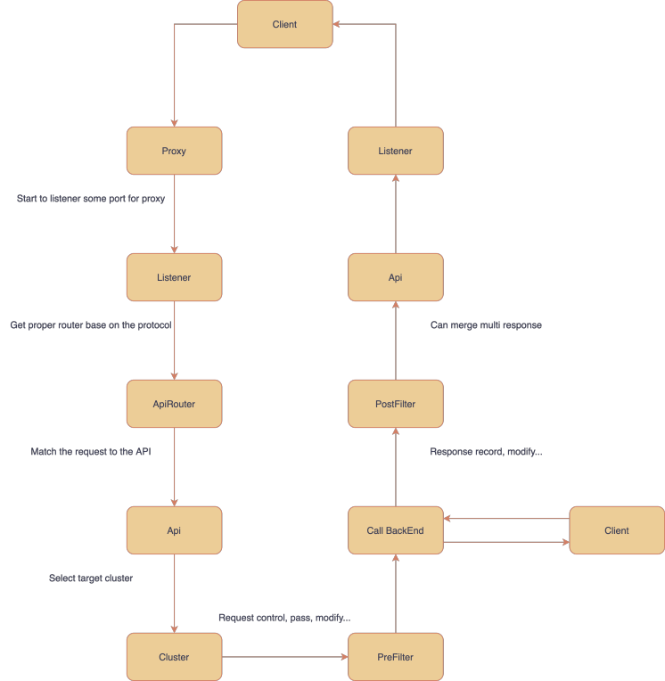

[](https://travis-ci.org/dubbogo/dubbo-go-pixiu)

### 吉祥物

<div>
<table>
  <tbody>
  <tr></tr>
    <tr>
      <td align="center"  valign="middle">
        <a href="http://alexstocks.github.io/html/dubbogo.html" target="_blank">
          
        </a>
      </td>
    </tr>
    <tr></tr>
  </tbody>
</table>
</div>

### 简介

dubbo-go-pixiu 网关支持调用Java的dubbo集群和golang的dubbo-go集群。

现在dubbo-go-pixiu 已经支持以dubbo协议和http协议调用远程的 dubbo 集群，未来还会支持更多的协议。

## 快速开始

#### 1 CD到目标路径

```
cd samples/dubbo/simple
```
可以使用 start.sh 脚本快速启动案例项目，可以执行如下命令来获得更多信息

```
./start.sh [action] [project]
./start.sh help
```
下列步骤中，我们将启动 body 案例项目

#### 2 准备配置文件和外部依赖docker
使用 start.sh 的 prepare 命令来准备配置文件和外部docker依赖
```
./start.sh prepare body
```
如果想要手动准备文件，需要注意：
- 将conf.yaml中的$PROJECT_DIR 修改为本地绝对路径

#### 3 启动 dubbo 服务或者 http 服务
```
./start.sh startServer body
```
#### 4 启动 pixiu
```
./start.sh startPixiu body
```
可以使用下列命令来手动启动 pixiu
```
 go run cmd/pixiu/*.go gateway start -c /[absolute-path]/dubbo-go-pixiu/samples/dubbo/simple/body/pixiu/conf.yaml
```


#### 5. 尝试请求
可以使用 curl 或者执行单元测试来验证一下
```
curl -X POST 'localhost:8881/api/v1/test-dubbo/user' -d '{"id":"0003","code":3,"name":"dubbogo","age":99}' --header 'Content-Type: application/json' 
./start.sh startTest body
```

#### 6. 清除
```
./start.sh clean body
```

## 特性

- 多协议支持
    - HTTP 代理，基于官方 net/http 包
    - Dubbo 代理，基于 [dubbogo](https://github.com/apache/dubbo-go) (1.5.5) 泛化调用
- 多形式的 Dubbo 配置
    - 标准的 API 接口配置：配置 API 到 Dubbo 之间的关系
    - 通用的 API 接口配置：把请求的接口信息通过 POST 请求携带过来转换（兼顾[dubbo-proxy](https://github.com/apache/dubbo-proxy)）
- 动态特性
    - 路由重写，支持请求发送到上游之前重写 host, uri, schema,headers（开发中）
    - 超时控制
    - 限流熔断（开发中）
    - 插件机制（开发中）
    - 路由匹配
    - 支持传统的网关接口自定义映射外，还支持自动识别注册中心的 RPC 服务暴露 HTTP 接口（开发中）
- 控制面板（开发中）
- 安全
    - IP 黑白名单
- 云原生支持 
    - istio 下支持 dubbo 协议流量（规划中）
    - 能支持边车和集中部署（规划中）                       

## 架构图

<div>
<table>
  <tbody>
  <tr></tr>
    <tr>
      <td align="center"  valign="middle">
        <a href="http://alexstocks.github.io/html/dubbogo.html" target="_blank">
          
        </a>
      </td>
    </tr>
    <tr></tr>
  </tbody>
</table>
</div>

## 流程图


<div>
<table>
  <tbody>
  <tr></tr>
    <tr>
      <td align="center"  valign="middle">
        <a href="http://alexstocks.github.io/html/dubbogo.html" target="_blank">
          
        </a>
      </td>
    </tr>
    <tr></tr>
  </tbody>
</table>
</div>

## 术语解释

### 组件

#### Pixiu

数据面板

#### Admin

控制面板

### 概念

#### 下游（Downstream）

下游主机连接到 Pixiu ，发送请求并接收响应。（API 网关场景理解：浏览器）

#### 上游（Upstream）

上游主机接收来自 Pixiu 的连接和请求并返回响应。（API 网关场景理解：dubbo 服务的机器）

#### 监听器（Listener）

监听器是可以被下游客户端连接的网络位置（例如，端口，unix域套接字等）。Pixiu 公开一个或多个下游主机连接的监听器。

#### 集群（Cluster）

群集是指 Pixiu 连接到的一组逻辑上相似的上游主机（比如 dubbo 集群）。Pixiu 通过服务发现发现一个集群的成员，它可以通过主动健康检查来确定集群成员的健康度，从而 Pixiu 通过负载均衡策略将请求路由到相应的集群成员。

#### 接口（Api）

接口是 API 网关的核心概念，特别针对浏览器等外部系统的访问时必须开启，所有请求必须匹配到对应的 Up 状态的接口才能继续进行后续逻辑。

#### 客户端（Client）

请求上游主机的真实调用对象。

#### 路由（Router）

路由策略，目前理解成 HTTP 路由，通过 match 逻辑路由到对应的集群。

#### 上下文（Context）

一个真实请求的上下文，包含这次请求几乎所有的信息。在各个环节都会使用，特别是 filter 链路。

#### 过滤器（Filter）

过滤器，提供拦截能力。支持自定义扩展。

#### 规则（Rule）

规则提供匹配能力，给过滤器，路由等其它概念使用。

## 联系我们

项目在快速迭代中，欢迎使用， 欢迎给出建议或者提交pr。钉钉群: 31363295


## 社区

如果想访问官方钉钉群，请在钉钉中搜索社区群号 31363295 或者 扫描如下[二维码](https://mmbiz.qpic.cn/mmbiz_jpg/yvBJb5IiafvnHVBdtia30dxA2hKotr9DEckWsZ7aOJcDWDaSVMGwLmYv8GRgIQtqb4C2svicp8nVkMmGy7yKC5tyA/640?wx_fmt=jpeg&tp=webp&wxfrom=5&wx_lazy=1&wx_co=1)。

<div>
<table>
  <tbody>
  <tr></tr>
    <tr>
      <td align="center"  valign="middle">
        <a href="http://alexstocks.github.io/html/dubbogo.html" target="_blank">
          
        </a>
      </td>
    </tr>
    <tr></tr>
  </tbody>
</table>
</div>

dubbogo 社区已经开通微信公众号 "dubbogo大区"，可在微信搜索 "dubbogo大区" 或者扫描如下二维码关注，可通过公众号私信留言加入 dubbogo 微信社区。

<div>
<table>
  <tbody>
  <tr></tr>
    <tr>
      <td align="center"  valign="middle">
          
        </a>
      </td>
    </tr>
    <tr></tr>
  </tbody>
</table>
</div>


## License

Apache License, Version 2.0